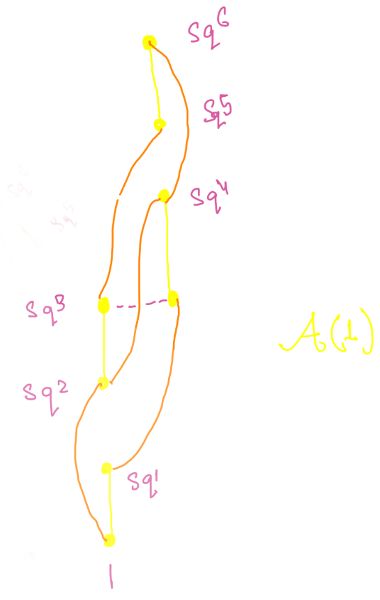



## Introduction

In the previous part, we discussed the construction of Steenrod operations and their interpretation as *stable cohomology operations*. We concluded by listing several fundamental properties. Let us now summarize them clearly before exploring the structure they generate.

- The stable cohomology operations are denoted $Sq^i$ for $i \geq 0$.
- For each $n \geq 0$,  
  $$ Sq^n : H^q(X; \mathbb{Z}_2) \longrightarrow H^{q+n}(X; \mathbb{Z}_2) $$
  is a stable cohomology operation.
- $Sq^{0}$ acts as the identity.
- For $x \in H^{p}(X; \mathbb{Z}_2)$ (i.e., $\deg x = p$), we have $Sq^i(x) = 0$ if $i > p$.
- $Sq^n(x) = x^2$ whenever $\deg x = n$.
- **Cartan formula:**  
  $$ Sq^i(xy) = \sum_{j} Sq^j(x) \, Sq^{i-j}(y) $$
- **Adem relation:** For $i < 2j$,  
  $$ Sq^i Sq^j = \sum_k \binom{j - k - 1}{i - 2k} \, Sq^{i+j-k} Sq^k $$
- $Sq^1$ coincides with the *Bockstein homomorphism* associated to the short exact sequence  
  $$ 0 \to \mathbb{Z}_2 \to \mathbb{Z}_4 \to \mathbb{Z}_2 \to 0. $$

---

## Small Examples

Since we are working over $\mathbb{Z}_2$, the binomial coefficients are reduced mod 2, and Pascal’s triangle provides intuition for the Adem relations:

- $Sq^1 Sq^1 = 0$.
- $Sq^1 Sq^2 = Sq^3 \neq Sq^2 Sq^1$.
- $Sq^2 Sq^2 = Sq^3 Sq^1 = Sq^1 Sq^2 Sq^1$.

In general, for a tuple $I = (i_1, \dots, i_k)$ we define  
$$ Sq^I = Sq^{i_1} \cdots Sq^{i_k}, $$
and say that the **degree** of $I$ is $\deg I = i_1 + \cdots + i_k$.

- **Definition:** A sequence $I$ is *admissible* if $i_j \ge 2 i_{j+1}$ for all $j$.
- The **excess** of an admissible sequence is $e(I) = 2i_1 - \deg I$.

---

## The Steenrod Algebra

The collection of all Steenrod squares forms an algebraic structure:

> **Definition:**  
> The **Steenrod algebra** $\mathcal{A}$ is the free graded (noncommutative) $\mathbb{Z}_2$-algebra generated by elements $Sq^i$ for $i \ge 0$, with grading $\deg Sq^i = i$, subject to the Adem relations.

---

### Key Structural Theorems

- **Minimal Generators:**  
  $\mathcal{A}$ is generated by $\{ Sq^{2^i} : i \ge 0 \}$.

- **Basis Theorem:**  
  The set $\{ Sq^I : I \text{ admissible} \}$ forms a $\mathbb{Z}_2$-basis of $\mathcal{A}$.

---

### Hopf Algebra Structure

The Cartan formula implies that the assignment
$$ Sq^k \longmapsto \sum_{i+j=k} Sq^i \otimes Sq^j $$
is an algebra homomorphism. Hence, $\mathcal{A}$ acquires a coproduct and becomes a **cocommutative Hopf algebra**. Its dual, $\mathcal{A}_\ast$, is a *commutative* algebra.

> **Milnor’s Theorem:**  
>
> $$\mathcal{A}_\ast = \mathbb{Z}_2[\zeta_1, \zeta_2, \ldots], \quad \deg \zeta_i = 2^i - 1,$$ with coproduct 
>
> $$\Delta(\zeta_k) = \sum_{i=0}^k \zeta_{k-i}^{2^i} \otimes \zeta_i.$$ 
>
> Here, $\zeta_k$ is dual to $Sq^{I_k}$, where $I_k = (2^{k-1}, \cdots, 1, 0)$.

For concreteness, we often denote by $\mathcal{A}(k)$ the subalgebra generated by $\{ Sq^i : i \le 2^k \}$.  
For instance, the relations in $\mathcal{A}(1)$ can be visualized in the diagram on the right.

---

## Unstable Modules over $\mathcal{A}$

For any space $X$, the total Steenrod square  
$$ Sq = \sum_i Sq^i $$
acts on $H^\ast(X; \mathbb{Z}_2)$, and by the Cartan formula this action is multiplicative, making $H^\ast(X; \mathbb{Z}_2)$ an **unstable $\mathcal{A}$-module**.

### Example 1: $\mathbb{R}P^\infty$

We know
$$ H^\ast(\mathbb{R}P^\infty; \mathbb{Z}_2) \cong \mathbb{Z}_2[x], \quad \deg x = 1. $$

Since $Sq(x) = x + x^2$, by multiplicativity we obtain
$$ Sq(x^k) = Sq(x)^k = (x + x^2)^k, $$
and hence
$$ Sq^i(x^k) = \binom{k}{i} x^{k+i}. $$

---

### Example 2: Detecting Nontrivial Maps via Steenrod Squares

Consider $\Sigma \mathbb{C}P^2$ and $S^3 \vee S^5$.  
Though these spaces have the same cohomology *rings*, they are not homotopy equivalent.

Indeed, $H^\ast(\mathbb{C}P^2; \mathbb{Z}_2) \cong \mathbb{Z}_2[x]$ with $\deg x = 2$, and $Sq^2(x) = x^2$.  
By stability,
$$ Sq^2(\Sigma x) = \Sigma x^2, $$
showing an $Sq^2$-link between degrees 3 and 5.  
No such link exists for $S^3 \vee S^5$, proving that $\Sigma \mathbb{C}P^2$ cannot be a wedge of spheres.

In fact:

- For any $k$, $\Sigma^k \mathbb{C}P^2$ is not homotopy equivalent to a wedge of spheres.
- Equivalently, the Hopf map $\eta: S^3 \to S^2$ never becomes null after suspension.  
  By Freudenthal’s suspension theorem, $\Sigma^k \eta$ represents the generator of the **first stable stem**, $\pi_1^S$.

---

## Indecomposables and Consequences

A Steenrod square $Sq^n$ is called **decomposable** if it can be written as
$$ Sq^n = \sum_{k < n} Sq^{I(k)} Sq^k. $$
It is **indecomposable** otherwise.

> **Fact:** $Sq^n$ is indecomposable if and only if $n = 2^k$.

This gives an elegant criterion on polynomial cohomology algebras:

> **Corollary:**  
> If $H^\ast(X; \mathbb{Z}_2) \cong \mathbb{Z}_2[x]$, then necessarily $\deg x = 2^n$ for some $n$.

**Proof:**  
If $\deg x = n$, then $Sq^n(x) = x^2$.  
If $Sq^n$ were decomposable, the lower operations would vanish on $x$.  
Thus, $Sq^n$ must be indecomposable, forcing $n = 2^k$.

---

<head>
  <link rel="stylesheet" href="https://cdnjs.cloudflare.com/ajax/libs/KaTeX/0.7.1/katex.min.css">
  
  
</head>
<body>
  
</body>
</html>
