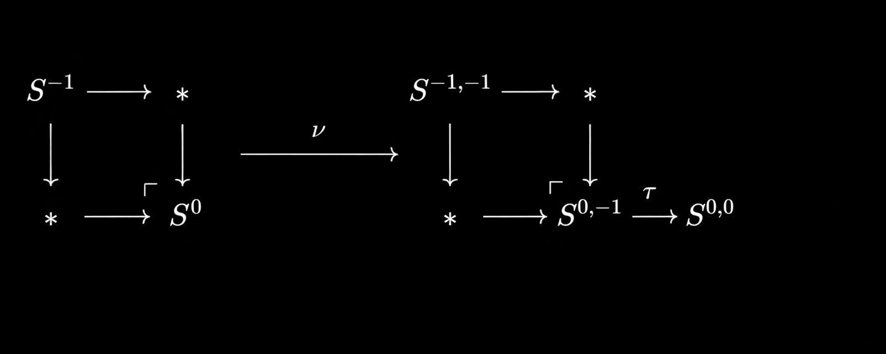



## Introduction

As is well known, the Adams Spectral Sequence (ASS) and the Adams–Novikov Spectral Sequence (ANSS) have been major computational tools in understanding the $2$-primary component of the stable stems. In recent years, *synthetic homotopy theory* has emerged as a powerful framework for understanding these spectral sequences. In work of Burkland, Senger, and Hahn, the Adams Spectral Sequence is described completely in the language of synthetic homotopy theory. Using this framework, they obtain new vanishing bounds for the ASS and detect elements in the stable stems outside the image of the $J$-homomorphism. We will see glimpses of these ideas throughout this series.

Readers familiar with motivic homotopy theory may find the construction of the synthetic homotopy category very familiar and may expect a close relationship with the stable motivic homotopy category $\mathcal{SH}(k)$. Indeed, such a relationship was established by [Piotr Pstragowski](https://arxiv.org/pdf/1803.01804), which I may discuss in a future blog series.

---

For this blog, we will work with *special* types of spectra $E$, defined below. These spectra play a crucial role because they allow us to construct Adams resolutions of spectra and hence the Adams Spectral Sequence.

> A spectrum $E$ is called a **special type spectrum** if:
>- it is an $\mathbb{E}_{\infty}$-ring spectrum;
>- the multiplication map $\pi_0(E) \otimes \pi_0(E) \to \pi_0(E)$ is an isomorphism;
>- $H_\ast E$ is finitely generated in each degree;
>- $E_\ast E$ is flat as an $E_\ast$-module.

## Setup

In this section, we work with $\infty$-categories. Readers who are less familiar with $\infty$-categories may think of them as categories equipped with higher morphisms and coherence data, allowing one to define limits, colimits, and homotopical constructions. An $\infty$-model category provides a suitable setting for doing homotopy theory, which is the main takeaway for our purposes.

If $\mathcal{C}$ is an $\infty$-category equipped with adjoint functors
$$
F : \mathcal{C} \rightleftharpoons \mathcal{D} : G,
$$
we define the stabilization of $\mathcal{C}$ with respect to $(F,G)$ by
$$
\mathrm{Stab}_{(F,G)}(\mathcal{C})
= \varprojlim\bigl(\cdots \mathcal{C} \to G \mathcal{C} \to \cdots \bigr).
$$

The $\infty$-category of spaces $\mathcal{S}$ and the $\infty$-category of spectra $\mathrm{Sp}$ will be particularly important for us, with $\mathcal{S}\subset \mathrm{Sp}$. A classical example of stabilization is the stable homotopy category arising from the suspension–loop adjunction.

We now recall the notion of a Grothendieck topology. For a topological space, its essential structure is encoded by its open sets and their coverings. Abstracting this idea leads to the concept of a Grothendieck topology.

> **Definition.**  
> Let $\mathcal{C}$ be a category with pullbacks. A **Grothendieck cover** on $\mathcal{C}$ consists of a family of morphisms $\mathcal{U}=\{U_i\}_i$ together with a map
> $$
> \coprod_i U_i \longrightarrow \mathrm{Obj}(\mathcal{C})
> $$
> such that:
> - the identity morphism $1_{\mathcal{C}}$ is a covering;
> - coverings are closed under pullbacks (fiber products);
> - if $\{V_{ij}\}_j \to U_i$ is a covering and $\{U_i\}_i \to \mathcal{C}$ is a covering,
>
>   then $\{V_{ij}\}_{i,j} \to \mathcal{C}$ is also a covering.

The topology $\mathcal{T}$ defined by such coverings makes $(\mathcal{C},\mathcal{T})$ into a **site**. If $\mathcal{C}$ is an $\infty$-category, one defines an $\infty$-site similarly. A *small* $\infty$-site is one in which all coverings are singleton sets. A morphism of sites $F:\mathcal{C}\to\mathcal{D}$ is required to send coverings in $\mathcal{C}$ to coverings in $\mathcal{D}$ via pullback.

Once a Grothendieck topology is fixed, one can define presheaves and sheaves on the site. In a category with finite products and coproducts, a presheaf is called **spherical** if it preserves coproducts.

We use the following notation:
- $\mathrm{Sh}^{\mathcal{D}}(\mathcal{C})$: sheaves of $\mathcal{D}$-objects on $\mathcal{C}$;
- $\mathrm{PreSh}^{\mathcal{D}}(\mathcal{C})$: presheaves of $\mathcal{D}$-objects on $\mathcal{C}$;
- $\mathrm{Sh}^{\mathcal{D}}_{\Sigma}(\mathcal{C})$: spherical sheaves;
- $\mathrm{PreSh}^{\mathcal{D}}_{\Sigma}(\mathcal{C})$: spherical presheaves.

> **Theorem (Pstrągowski).**  
> Let $\mathcal{C}$ and $\mathcal{D}$ be $\infty$-categories. If
> $$
> X\in \mathrm{PreSh}^{\mathcal{D}}_{\Sigma}(\mathcal{C}),
> $$
> then $X$ is a spherical sheaf if and only if $X$ sends fiber sequences to fiber sequences.

Consider $\mathrm{Sh}^{\mathcal{S}}(\mathcal{C})$. The loop functor $\Omega:\mathcal{S}\to\mathcal{S}$ induces a functor
$$
\Omega:\mathrm{Sh}^{\mathcal{S}}(\mathcal{C})\to\mathrm{Sh}^{\mathcal{S}}(\mathcal{C}),
$$
since looping preserves pullbacks. It has a right adjoint $\Sigma$. A theorem of Pstrągowski shows that

$$\mathrm{Sh}^{{Sp}}(\mathcal{C}) \simeq \text{Stab}_{(\Sigma, \Omega)} {Sh}^{S}(C)$$

Similarly, one obtains $\mathrm{Sh}^{{Sp}}_{\Sigma}(\mathcal{C})$, which is a presentable $\infty$-category admitting all small colimits and filtered colimits.

An **excellent $\infty$-site** is an $\infty$-site equipped with a symmetric monoidal structure such that every object admits a dual and the tensor product preserves coverings.

> **Theorem (Pstrągowski).**  
>
> If $\mathcal{C}$ is an excellent $\infty$-site, then the category $\mathrm{Sh}^{\mathrm{Sp}}_{\Sigma}(\mathcal{C})$
> admits a symmetric monoidal structure. Moreover, there is a symmetric monoidal functor
> 
> $$\mathrm{Sh}^{\mathcal{S}}\_{\Sigma}(\mathcal{C}) \to Sh^{Sp}\_{\Sigma}(C)$$
>
> which admits a right adjoint $\Omega^{\infty}$.
---- 

## Synthetic spectra

Let $E$ be a special spectrum. A spectrum $X$ is called a **finite projective $E$-spectrum** if $E_{\ast}X$ is a finitely generated projective $E_{\ast}$-module. Let $\mathrm{Sp}^{fp}_E$ denote the $\infty$-category of finite projective $E$-spectra; this category forms an excellent $\infty$-site.

We define the category of **synthetic spectra** by

$${Syn}\_E= Sh^{Sp}\_{\Sigma}(Sp_{E}^{fp})$$

*Remark.* :  The $\infty$-category $\mathrm{Syn}_E$ is presentable and carries a symmetric monoidal structure induced by the tensor product of finite projective $E$-spectra. There is a synthetic analogue functor
$$
\nu : \mathrm{Sp} \longrightarrow \mathrm{Syn}_E,
$$
obtained by lifting the Yoneda embedding
$$
y : \mathrm{Sp} \to \mathrm{PreSh}^{\mathrm{Sp}}(\mathrm{Sp}^{fp}\_E),
\qquad
y(X)(P)=\mathrm{Hom}\_{\mathrm{Sp}}(P,X),
$$
and then applying suspension.

---

## More on $\mathrm{Syn}_E$ and its connection to the ASS

- The functor $\nu : \mathrm{Sp}\to\mathrm{Syn}_E$ is lax symmetric monoidal and preserves filtered colimits.
- When restricted to $\mathrm{Sp}^{fp}_E$, it is symmetric monoidal.
- It sends a cofiber sequence to a cofiber sequence if and only if the induced sequence becomes short exact after applying $E_{\ast}$.

There exist bigraded spheres
$$
S^{p,q} := \Sigma^{p-q}\nu S^{q},
$$
where $p$ is the total degree and $q$ is the twisted (motivic-like) degree. These spheres are invertible and induce autoequivalences
$$
\Sigma^{p,q} : \mathrm{Syn}\_E \to \mathrm{Syn}\_E.
$$
Thus one can define bigraded homotopy groups by
$$
\pi_{p,q}(X)
:= \pi_0\bigl(\mathrm{Map}_{\mathrm{Syn}_E}(S^{p,q},X)\bigr).
$$

> **Proposition.**  
> There is a natural isomorphism
> $$
> \pi\_{p,q}(X)=\pi\_{p-q}\bigl(X(S^q)\bigr).
> $$

 **Proof.**  Observe that
$$
 \mathrm{Map}(\nu P,X)
 = \mathrm{Map}(y(P),\Omega^{\infty}X)
 = \Omega^{\infty}X(P).
 $$ 
 Expanding the definitions yields the result $\square$.

 As a corollary, for $X\in\mathrm{Sp}$ we have
$$
\pi_{p,q}(\nu X)=\pi_{p-q}(X),
$$
a fact that will be crucial for our purposes.

We now define the important map $\tau$ as follows:

> **Theorem (Pstrągowski).**  
> - The localization functor inverting $\tau$ is symmetric monoidal.
> - The full subcategory $\mathrm{Syn}\_E[\tau^{-1}]$ is equivalent to $\mathrm{Sp}$.
> - The composite $\tau^{-1}\circ \nu$ is equivalent to the identity.

The cofiber $C\tau$ of $\tau$ is an important object of $\mathrm{Syn}\_E$. It admits the structure of an $E\_{\infty}$-algebra, and several deep connections arise from this object.

From work of Barthel, Heard, and Valenzuela, the lax monoidal functor
$$
E_{\ast} : \mathrm{Sp}^{fp}\_E \longrightarrow \mathbf{Comod}^{fp}\_{E\_{\ast}E}
$$
induces an equivalence
$$
\chi^{\ast} :
\mathrm{Mod}\_{C\tau}(\mathrm{Syn}\_E)
\simeq
\mathrm{Stable}\_{E\_{\ast}E\text{-}\mathbf{Comod}},
$$
provided that $E$ has enough projectives (in particular, for Landweber-exact $E$).Thus we get the following diagram connecting different categories we are interested in:

At the end I would like to bring an important remark from the work of Pstragowski that would be very helpful for the purpose of our blog. That is 

$$\pi\_{p,q}(C \tau \otimes \nu X)= \text{Ext}\_{E\_{\ast}E}^{s,t}(E\_{\ast},E\_{\ast}X)$$ 

which is the familiar $E_2$-page of the ASS. This blog has already been so long, so I'll try to explain the connection in next blog.

---

<head>
  <link rel="stylesheet" href="https://cdnjs.cloudflare.com/ajax/libs/KaTeX/0.7.1/katex.min.css">
  
  
</head>
<body>
  
</body>
</html>

