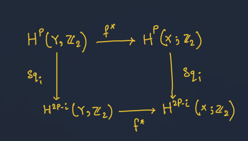



## Introduction

Let \\(k\\) be a generalized cohomology theory on the category of CW complexes. Then cohomology operation of type $(n,n+m,\pi,G)$ is a natual transformation $\phi : k^{n}(-,\pi)\to k^{n+m}(-,G)$. 

By the *Brown representability theorem* we can represent $k^{n}$ by some based topological space $Z$. The following lemma will ensure that the cohomology operation are in one one correspondence with the elements of $k^{n+m}(Z;G)$. 

> There is a correspondence between the natural transformations $\Phi : k\mathbb{R}ightarrow h$ where $k,h$ are contravariant functor and $k$ is represented by $[-,Z]$ with the elements of $h(Z)$.

 We want to show for every $\Phi : k \to h$  there is an element $\phi \in h(Z)$. Define $\phi : = \Phi(1)$ here $1$ is the identity of $k(Z)=[Z,Z]$, thus $\phi \in h(Z)$. If $\phi \in h(Z)$, we define $\Phi: k \to h$ by $\phi(X): k(X)\to h(X)$ is given by $\phi \mapsto f^{\ast}\phi$. 

-------

In this blog we will deal with ordinary cohomology theory. If $G$ and $\pi$ are abelian groups the cohomology $k^q(-;\pi)$ is represented by $[-,K(\pi,n)]$ and the other one is representted by $[-,K(G,n+m)]$ then the cohomology operations of type $(n.n+m,\pi,G)$ are in one one correspondence with $[K(\pi,n),K(G,n+m)]$. If $m=0$ this is nothing but $Hom(\pi,G)$. 

- There is a class of cohomology that commutes with $\partial : H^{\ast}(X,A)\to H^{\ast +1}(A)$, particularly with the suspension. We call them stable cohomology operation. One of them is steenrod operation. 

The purpose of this blog is to show construction of such operation. In the upcoming blogs of this series we will use it heavily. One can skip the constrction of steenrod operations and work only with the algrebraic properties, just for my redaing/completeness of the series I will be writing that here. 

## Setup for the constuction

We will construct the steenrod operations of type $(n,n+m,\mathbb{Z}_2)$. For that we need a proper description of $K(\mathbb{Z}_2,1)$. We know that as a CW-complex $K(\mathbb{Z}_2,1)$ is unique upto homotopy equivalance. 

Note that $\mathbb{R} P^{\infty}$ is $colim (\mathbb{R} P^{n}\hookrightarrow \mathbb{R} P^{n+1})$. Using the fact that homotopy group commutes with colimit and the covering space $S^{\infty}\to \mathbb{R} P^{\infty}$ we get, $$\pi_k(\mathbb{R} P^{\infty}) = \pi_k(S^{\infty})$$ is trivial for $k \geq 2$. For $k=1$, it's $\mathbb{Z}_2$. 

 - Thus $\mathbb{R} P^{\infty}$ is $K(\mathbb{Z}_2,1)$ upto homotopy equivalence. 

We will give $S^{\infty}$ a celluler structure. For every dimension $i$ we have two cell $d_i$ and $Td_i$. The action of homology boundary $\partial$ is given by $$\partial d_i = d_{i-1}+(-1)^iTd_{i-1}$$ (here we can use $T$ as an operator satisfying the properties $T\partial = \partial T$ and $TT=1$). We can compute the cellular homology whcih turns out to be trivial for $i \geq 1$.

From the above cellular structure of $S^{\infty}$ we can give $R P^{\infty}$ a cell structure which is basicale obtained by identifying $d_i$ with $Td_{i}$ for all $i$. And thus the boundary operator is $0$ when $i$ is odd and it's $2d_{i-1}$ when $i$ is even so the homology is nothing but $Z_2$ for $i$ odd and trivial for $i$ even. Applying universal coefficient theorem we can say the cohomology of $K(Z_2,1)$ is $Z_2$ for every index $i$. The cohomology ring of the Eilenberg-MacLane space will be $$H^{\ast}(K(Z_2,1))=Z_2[\alpha]$$ where $\alpha$ is generator of $H^1$.

 ### Acyclic carrier theorem

 Now we will describe some technical definitions for *the acyclic carrier theorem*. Let $\mathcal{W}$ be the chain complex of $S^{\infty}$ (as we have described above), it's a $Z_2$ free acyclic chain complex with two generators.  

Define, $r: \mathcal{W} \to \mathcal{W} \otimes \mathcal{W}$ by $r(d_j) =\sum_{j}(-1)^{j(i-j)}d_j \otimes T^j d_{i-j}$ and $r(Td_j)=T(rd_j)$. It's not hard to see $r$ is a chain map with the usual boundary $\partial$. Note that if $h$ is a diagonal map of $Z_2$ , $r$ is $h$-equivarient, i.e. $r(gw)=h(g)r(w)$. Therefore $r$ induces a chain map $$s: \mathcal{W}/T \to \mathcal{W}/T \otimes \mathcal{W}/T$$ which is a map for the chain complex of $RP^{\infty}$. This $s$ is called *diagonal approximation* of $RP^{\infty}$.

Let $\pi, G$ be groups (not necessarily abelian) and let $Z[\pi]$ denote the group ring of $\pi$. $K$ be a $\pi$-free chain complex with a $Z[\pi]$ basis $B$ of homgeneous elements called **cells**. For $a,b \in B$, $[a:b]$ denote coefficient of $b$ in $\partial a$. Let $G$ acts on a chain complex $L$ and let $h$ be a homomorphism $\pi \to G$.

- **Definition:** An $h$-equivariant carrier $\mathcal{C}$ from $K$ to $L$ is a function from $B$ to the subcomplexes of $L$ such that:  
 If $[a:b]\neq 0$ then $ \mathcal{C} b \subset \mathcal{C} a$ and for $x \in \pi$ and $a \in B$, $h(x) \mathcal{C} a \subset \mathcal{C} a$.

 The carrier is siad to be *acyclic* if the subcomplex $\mathcal{C}a$ is acyclic for every cell $a \in B$. The $h$-chain map $f:K \to L$ is said to be carried by $\mathcal{C}$ if $fa \in \mathcal{C} a$ for all $a \in B$.

><a style="color:yellow">Acyclic carrier theorem.</a> Let $\mathcal{C}$ be an acyclic carrier from $K$ to $L$. Let $K^{\prime}$ be a subcomplex of $K$ which is a $Z[\pi]$-free complex on a subset of $B$. Let $f: K^{\prime} \rightarrow L$ be an $h$-equivariant chain map carried by $\mathcal{C}$. 
>
>Then $f$ extends over all of $K$ to an $h$-equivariant chain map carried by $\mathcal{C}$. Moreover the extension is unique up to an $h$-equivariant chain homotopy carried by $\mathcal{C}$. 
	
**Outline of the proof.** The proof proceeds by induction on the dimension, suppose that $f$ has been extended over all of $K^q$ and consider a $(q+1)$-cell $\tau \in B$. Then $\partial \tau=\sum a_i \sigma_i$ where $a_i=\left[\tau, \sigma_i\right] \in Z(\pi)$. Thus $$f(\partial \tau)=\sum f\left(a_i \sigma_i\right)=\sum h\left(a_i\right) f\left(\sigma_i\right)$$ which is in $C_\tau$ by properties (1) and (2). Since $f$ is a chain map, $f(\partial \tau)$ is a cycle, but then, since $e_\tau$ is acyclic, there must exist $x$ in $C_\sigma$ such that $\partial x=f(\partial \tau)$. Choose any such $x$, and put $f(\tau)=x$. This is the essential step in the construction, $f$ is extended over $K^{q+1}$ by requiring it to be $h$-invariant. Uniqueness is proved by applying the construction to the complex $K \times I$ and its subcomplex $K^{\prime} \times I \cup K \times 1$.
    
## Cup-$i$ products 

Now let $K=C_{\ast}(X)$ be the chain complex of a simplicial complex $X$ and $\mathcal{W}$ is as before, we can define an action of $Z_2$ on $\mathcal{W} \otimes K$ by $T(w \otimes k) = (Tw)\otimes k$ and on $K \otimes K$ by $T(x\otimes y) = (-1)^{\delta g x \delta g y}y \otimes x$. If $\sigma$ is a generator of $K=C(X)$, we can identify $C_{\ast}(\sigma \times \sigma) = C_{\ast}(\sigma)\otimes C_{\ast}(\sigma)$ and the later one is subcomplex of $K \otimes K$. Let, $\mathcal{C}$ be a \textit{carrier} from $W\otimes K$ to $K \otimes K$ defined as follows: $$\mathcal{C}: d_i \otimes \sigma \mapsto C_{\ast}(\sigma \times \sigma)$$ It's not hard to see the above carrier is acyclic and $h$-equivariant where $h$ is the identity map b/w $Z_2$. Consider the map $\varphi_0 : d_0 \otimes K \to K \otimes K$ (which is the diagonal map) by \ref{thm:acyc} we can extend this to the complex $\varphi: \mathcal{W} \otimes K \to K \otimes K$. With the above setup we define `cup-$i$ product' $$C^p(X)\times C^q(X) \to C^{p+q-i}(X)$$ by the formula $u \smile_{i}v (c) = (u\otimes v)(\varphi(d_i \otimes c))$, where $c \in C_{p+q-i}(X)$. If $\delta$ is the couboundary and $\partial$ is boundary we can say, $$\delta (u \smile_i v)(c) = u\smile_i v(\partial c)$$ By definition $\partial(d_i \otimes c)= \partial d_i \otimes c + (-1)^i d_i \otimes \partial c$. So, 
$$
	(u\otimes v)\varphi(d_i \otimes \partial c) = (-1)^i (u\otimes v)\varphi(\partial (d_i \otimes c))-(-1)^i(u\otimes v)\varphi(\partial d_i \otimes c)+ (-1)^i \delta (u\otimes v) \varphi(d_i \otimes c)-(-1)^i(u\otimes v)\varphi(d_{i-1}\otimes c) - (u\otimes v)\varphi(Td_{i-1}\otimes c)$$

### Steenrod squaring operation 

Let us define $Sq_i : H^p(X;Z_2)\to H^{2p-i}(X;Z_2)$ is a homomorphism given by $u \mapsto u \smile_i u$. If $f: X \to Y$ is < a continuous map then it induce a map: $$f^{\ast}: H^p(Y;Z_2)\to H^p(X;Z_2)$$  We will have the diagram commutes.

We define a **Steenrod operations** by $Sq^i = Sq_{p-i}$ for $0 \leq i \leq p$ and $Sq^i$ is understood to be the zero outside this range.

We know for any pair $(X,A)$ there is an exect sequence of cochian complexes $$0 \to C^{\ast}(X,A)\to C^{\ast}(X)\to C^{\ast} (A)\to 0$$ now call the first map $q$ which is injective, if $u \in C^{p}(X,A)$ and $v \in C^q(X,A)$ we define $u \smile_i v$ to be the element which is the unique inverse image of $qu \smile_i qv$ under the map $q$. This is well defined. So can define the $i$-cup product for pairs. Now if we assume $\de^{\ast}$ be the map $H^{q}(A)\to H^{q+1}(X,A)$ be the map that we get from the exact sequence of cochian complex (i.e. LES of pairs). It can be shown easily $Sq^i$ commutes with the morphism $\de^{\ast}$. As a corollary to it we can say $Sq^i$ commutes with the suspension (just by working with the pair $(Ci,X)$ where $i$ is the inclusion of $A$ in $X$). In other words the following diagram commutes, 

<iframe class="quiver-embed" src="https://q.uiver.app/#q=WzAsNCxbMCwwLCJIXnAoWCkiXSxbMSwwLCJIXntwKzF9KFxcU2lnbWEgWCkiXSxbMCwxLCJIXntwK2l9KFgpIl0sWzEsMSwiSF57cCtpKzF9KFxcU2lnbWEgWCkiXSxbMCwxLCJcXFNpZ21hIl0sWzAsMiwie1NxXml9IiwyXSxbMSwzLCJ7U3FeaX0iXSxbMiwzLCJcXFNpZ21hIiwyXV0=&embed" width="465" height="304" style="border-radius: 8px; border: none;"></iframe>

## Properties of the squaring operations

- For $n \geq 0$ the operations are stable cohomology operation $Sq^n : H^q(X;Z_2)\to H^{q+n}(X;Z_2)$.
- The homomorphism $Sq^{0}$ is identity. 
-  For $x \in H^{p}(X;Z_2)$ or $\deg x= p$ we have, $Sq^i(x)=0$ for $p>i$.
- $Sq^n(x)=x^2$ for $\deg x = n$.
- *Cartan formula:* $Sq^i(xy)= \sum_{j} Sq^jx Sq^{i-j}y$.   
- *Adem Relation.* The steenrod opertaions satisfy the following relation, (for $i<2j$) $$ Sq^iSq^j=\sum_k \binom{j-k-i}{j-2k}Sq^{i+j-k} Sq^k $$

<html>
<head>
    <link rel="stylesheet" href="https://cdnjs.cloudflare.com/ajax/libs/KaTeX/0.7.1/katex.min.css">
    
    
</head>
<body>
    
</body>
</html>